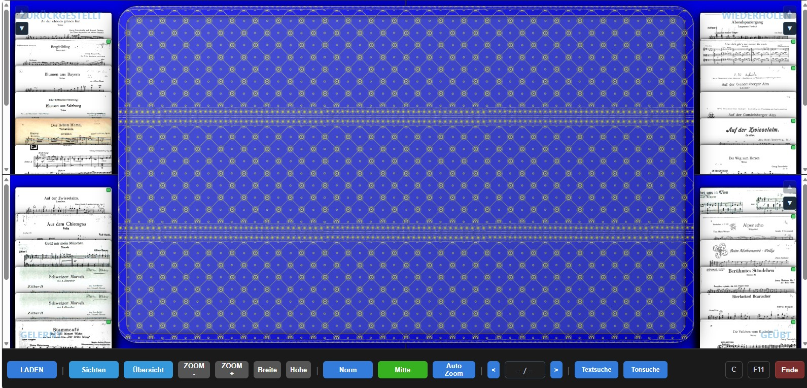
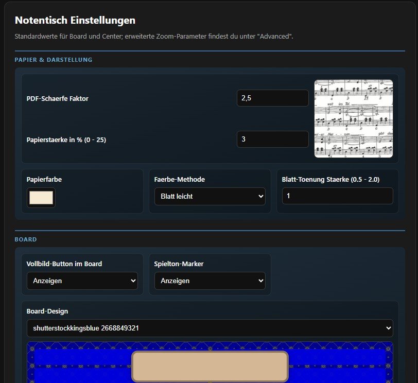
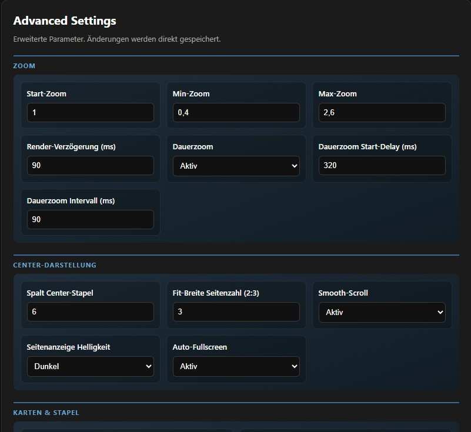

## Einblick

<p align="center">
  
</p>

<p align="center">
  
  
  
</p>

## Installation & Schnellstart

👉 Für Details siehe die vollständige Anleitung in **INSTALL.md**.  
👉 Für den Access/XML‑Austausch siehe **Zusammenarbeit Access-HTML.md**.

### 🔧 Erststart aus dem ZIP‑Download

1. ZIP herunterladen und entpacken  
2. **AutoInstaller.bat** starten
   - führt einmalig Setup und Card‑Extrakt aus  
   - startet danach automatisch den Notentisch  
3. Browser öffnet das Board  
4. Auf **LADEN** klicken und eine vorhandene XML wählen  
   - oder automatisch aus deinem PDF‑Ordner erzeugen lassen

### 🔁 Spätere Starts

- Starte einfach **Notentisch.bat**  
- Die zuletzt verwendete XML wird automatisch geladen  
- Über **LADEN** kannst du jederzeit eine andere XML auswählen

**Prüf-Checkliste für Regressionstests (Erststart):**
1. Ohne bekannte XML startet die App ohne Zwischendesign und ohne automatische XML-Ersatzdialoge.
2. Nach XML-Laden ohne Blätterordner wird `Blätterordner einstellen` angezeigt.
3. Bei passendem Blätterordner erscheint keine zusätzliche XML-Abfrage.
4. Bei unpassendem Blätterordner erscheint genau eine Abfrage zur XML-Weiterverwendung.
5. Ohne vorhandene Cards bleibt der Ablauf nutzbar; Kartenbilder können danach erzeugt werden.

**Manueller Testfall Erststart (5-Minuten-Check):**
1. Start mit sauberem Zustand: Browser öffnen, Board laden, noch keine XML aktiv.
  Soll: Board erscheint direkt mit letztem Preset (kein sichtbares Zwischendesign).
2. Klick auf **LADEN** und vorhandene XML auswählen.
  Soll: XML wird geladen, Titel/Kartenstatus sind verfügbar.
3. Es ist noch kein Blätterordner gesetzt.
  Soll: In der Statuszeile erscheint `Blätterordner einstellen`.
4. Blätterordner mit den zugehörigen PDFs setzen.
  Soll: Bei passendem Ordner kommt keine weitere XML-Abfrage.
5. Optionaler Negativtest: absichtlich falschen Blätterordner setzen und erneut XML laden.
  Soll: Genau eine Rückfrage erscheint (`OK = XML trotzdem verwenden`, `Abbrechen = andere XML wählen`).
6. Falls keine Cards existieren: Card-Export ausführen.
  Soll: Kartenvorschau ist anschließend sichtbar; CENTER kann PDF anzeigen.
7. Ein Blatt ins CENTER ziehen.
  Soll: PDF-Seiten werden geladen, Bedienung bleibt ohne zusätzliche Startdialoge nutzbar.

**Kurztest für Release-Abnahme (3 Pflichtprüfungen):**
1. XML laden bei noch nicht gesetztem Blätterordner.
  Soll: Status zeigt `Blätterordner einstellen`.
2. XML laden bei passendem Blätterordner.
  Soll: Keine zusätzliche XML-Abfrage.
3. XML laden bei absichtlich unpassendem Blätterordner.
  Soll: Genau eine Rückfrage (`OK = XML trotzdem verwenden`, `Abbrechen = andere XML wählen`).

**Wichtig für den Start:**
- Der PDF-Ordner muss als fester Pfad `Blätter/` verfügbar sein, typischerweise als Junction auf deinen lokalen Notenbestand.
- Für das Erzeugen von Kartenbildern braucht das Projekt Poppler, konkret `pdfimages.exe`. Im ZIP-Paket ist das lokal mit dabei; beim Build muss der Ordner `poppler-25.12.0/` im Projekt vorhanden sein.

> Die App arbeitet ohne Verzeichnis-Picker im Config-Dialog. Der Pfad zu `Blätter/` wird über die Projekt-/Setup-Struktur festgelegt.

## Inhaltsverzeichnis

- [Projekt-Funktions-Check (Test der Umgebung)](#projekt-funktions-check-test-der-umgebung)
- [Digitaler Notentisch](#digitaler-notentisch)
- [Aktuelle stabile Version](#aktuelle-stabile-version)
- [Sicherheitscheck (Stand: 16.03.2026)](#sicherheitscheck-stand-16032026)
- [Funktionen](#funktionen)
- [Start auf einem anderen Windows-System](#start-auf-einem-anderen-windows-system)
- [XML aus PDF-Verzeichnis erstellen oder ergänzen](#xml-aus-pdf-verzeichnis-erstellen-oder-ergänzen)
- [Desktop-Button erstellen](#desktop-button-erstellen)
- [Card-Bilder generieren](#card-bilder-generieren)
- [Bedienung](#bedienung)
- [Preset-Verwaltung](#preset-verwaltung)
- [Algorithmen](#algorithmen)
- [Audio Auto (Mikrofon)](#audio-auto-mikrofon)
- [Audio Auto Troubleshooting](#audio-auto-troubleshooting)
- [Center-/Zoom-Parameter (Basis fuer weitere Aenderungen)](#center-zoom-parameter-basis-fuer-weitere-aenderungen)
- [CenterAnsicht je Blatt (XML)](#centeransicht-je-blatt-xml)
- [Speichern](#speichern)
- [Access-Board-Sync (Normalfall)](#access-board-sync-normalfall)
- [Verzeichnisse (Ton/XML)](#verzeichnisse-tonxml)
- [Use Cases](#use-cases)
- [Dateiformat (XML)](#dateiformat-xml)
- [Projektdateien](#projektdateien)
- [Test-Ordner](#test-ordner)

---

## Projekt-Funktions-Check (Test der Umgebung)

Um zu prüfen, ob das Projekt in deiner aktuellen Umgebung korrekt funktioniert, kannst du wie folgt vorgehen:

1. Stelle sicher, dass Python 3 installiert ist und der Befehl `python` verfügbar ist.
2. Starte im Projektordner einen lokalen Server:

  ```powershell
  py -3 local_server.py 8000
  ```

3. Öffne im Browser die Seite:

  [http://localhost:8000/board.html](http://localhost:8000/board.html)

4. Überprüfe, ob die Anwendung lädt und die Grundfunktionen (Karten anzeigen, PDF-Ansicht, Drag & Drop) funktionieren.

5. Optional: Führe die Tests im `test/`-Ordner aus, um einzelne Funktionen automatisch zu prüfen:

  ```powershell
  cd test
  node hello.test.js
  ```

Wenn alle Schritte erfolgreich sind, ist das Projekt in deiner Umgebung funktionsfähig. Bei Problemen siehe Abschnitt "PROBLEMLOESUNG" in INSTALL.txt oder im README.
# Digitaler Notentisch

Interaktive Notenverwaltung mit 4 Quadranten, Drag & Drop, PDF-Viewer und XML-Import/Export.

## Aktuelle stabile Version

- **Release-Tag:** `v2026.04.15`
- **Datum:** 15.04.2026
- **Branch:** `main`

Highlights dieser stabilen Version:
- Umschaltbare Center-Ausrichtung (`Links/Mitte/Rechts`) mit persistenter Speicherung
- Feinere Zoomschritte + kontinuierlicher Zoom bei langem Tastendruck
- Zoom-Fokus ist fest auf `links-oben` gesetzt (kein Fokus-Umschalter mehr)
- `Auto Zoom` als Toggle (auto anwenden beim Drop ins Center + auto speichern beim Verlassen)
- 3-stufige Helligkeit fuer die Seitenanzeige (`dunkel|normal|hell`) in Advanced
- `Auto-Fullscreen beim Start` als schaltbare Advanced-Option
- Kein erzwungener Stack-Neuaufbau beim Zurücklegen aus dem Center
- Robustere PDF-Pfad-Fallbacks für Card-Vorschau und Center-Anzeige
- No-Cache-Header im lokalen Server gegen veraltete Browser-Stände

Aktueller Stand (04.04.2026):
- Rückkehr von `Config` stellt Stapel-Reihenfolge bevorzugt aus dem vorhandenen DOM wieder her.
- Spielmodus (`Spielen`/`Sichten`) bleibt beim Rückweg erhalten.
- Tonsuche-Button: Kurzdruck `Ton An -> Aus`, Langdruck in `Ton An -> Aufnahme`, in `Aufnahme -> Aus`.
- Bekannte Einschränkung: Bei einigen Browser-/Fullscreen-Kombinationen kann der Fullscreen beim Wechsel `Board -> Config -> Zurück` trotzdem verlassen werden.

Aktueller Stand (15.04.2026):
- Tonsuche-Fortschritt ist in allen Suchphasen sichtbar: `Sammeln` (grau), `Warten` (gruen), `Schwierig` (braun).
- In `Advanced` ist die Neuansatz-Pause bei Verspielern als feste Auswahl verfügbar (`800`, `1000`, `1500` ms).
- Suchlauf-Reset nach kurzer Spielpause wurde robuster gemacht, damit neue Ansaetze nicht an alten Votes haengen.
- Rueckkehr aus `Config/Advanced` nutzt beim DOM-/History-Restore den vorhandenen Zustand und vermeidet unnoetigen Stack-Neuaufbau (spuerbar schneller).
- Optionaler Paket-Guard fuer lokale Tests dokumentiert (`test/assert_no_extra_python_packages.ps1` mit Allowlist in `test/allowed-python-packages.txt`).

Aktueller Stand (28.04.2026):
- Neuer Modus `Uebersicht`: 4-spaltige Gesamtansicht aller Quadranten ohne CENTER.
- In `Uebersicht` werden Karten je Quadrant alphabetisch sortiert, Scrollen bleibt pro Quadrant moeglich.
- Doppelklick auf eine Karte in `Uebersicht` oeffnet die Karte im CENTER, ohne den Modus automatisch zu verlassen.
- Rueckkehr aus `Config` behaelt den `Uebersicht`-Status bei (Session-Snapshot inkl. Restore).
- Beim Verlassen von `Uebersicht` wird die zuletzt aktive CENTER-Karte wiederhergestellt (inkl. Runtime-View-Fallback).

Aktueller Stand (06.06.2026):
- Audio-Hinweise werden in der Command-Zeile im Statusfeld (`#commandStatus`) angezeigt; es gibt keine separaten Toast-Overlays.
- Bei unsicherem Treffer/Korrekturlauf wird
 der Kandidatenstatus als `1/3`, `2/3`, `3/3` mit Hinweis `Kurzdruck Hören` angezeigt.
- Wenn der Suchlauf mit `timeout_no_match` endet, startet ebenfalls der Top-Kandidaten-Korrekturlauf (statt sofortigem Abbruch).
- Pflegehinweis fuer die Entwicklung: Aenderungen immer in Source und in `dist/` spiegeln (Verzeichnis für die Appweitergabe).

Details siehe [CHANGELOG.md](CHANGELOG.md).

## Sicherheitscheck (Stand: 16.03.2026)

Diese Zusammenfassung dokumentiert den durchgefuehrten Sicherheitscheck inkl. technischer Ablauftests, Ergebnisse und bereits umgesetzter Gegenmassnahmen.

### Gepruefte Risiken

- Fehlfunktion/Verfuegbarkeit: Unbeabsichtigtes Stoppen des lokalen Servers ueber den Shutdown-Endpoint.
- Systemeingriffe: Setup mit Adminrechten, Ausfuehrungspolicy und automatischem Installer-Download.
- Integritaet von Setup-Downloads: Risiko durch manipulierten oder falsch signierten Installer.

### Ablauftests

- Shutdown-Test ohne Token: `POST /__shutdown__` ohne Auth-Header muss blockiert werden.
- Shutdown-Test mit gueltigem Session-Token: `POST /__shutdown__` mit Header `X-Notentisch-Token` muss funktionieren.
- Syntax-/Laufzeitcheck nach Anpassungen fuer `local_server.py` sowie der neuen Setup-Sicherheitslogik.

### Testergebnisse

- Ohne Token wird der Shutdown korrekt mit HTTP `403` abgelehnt.
- Mit gueltigem Token wird der Shutdown korrekt mit HTTP `200` akzeptiert.
- Der lokale Server bleibt auf `127.0.0.1` gebunden (kein externer Netz-Zugriff auf den Endpoint).

### Umgesetzte Sicherheitsmassnahmen

- **Token-gesicherter Shutdown-Flow**:
  - Neuer Session-Endpoint `/__session__` liefert ein pro Serverstart neu erzeugtes Token.
  - `/__shutdown__` akzeptiert nur noch `POST` mit `X-Notentisch-Token` und Body `shutdown`.
  - `GET /__shutdown__` ist deaktiviert (`405 Method Not Allowed`).
- **Timing-sicherer Tokenvergleich** auf Serverseite, um triviale Vergleichsangriffe zu reduzieren.
- **Setup-Haertung fuer Python-Download**:
  - Signaturpruefung (Authenticode) vor Ausfuehrung des Installers.
  - Erwarteter Signierer: *Python Software Foundation*.
  - Optional vorbereiteter SHA256-Vergleich (bei fest hinterlegtem Hash).
- **Reduzierter Policy-Eingriff im Setup**:
  - Entfernt: zusaetzliches `Set-ExecutionPolicy` im Skriptlauf.
  - Begruendung: Das Setup wird bereits explizit mit `-ExecutionPolicy Bypass` gestartet.

### Restrisiken / Hinweise

- CDN-Einbindung von PDF.js bleibt ein Supply-Chain-Risiko (bei kompromittiertem externen CDN).
- Admin-Setup bleibt ein bewusstes Betriebsmodell; daher Setup-Skripte nur aus vertrauenswuerdiger Quelle ausfuehren.
- Energieprofil-Aenderungen durch `Notentisch.bat` koennen bei hartem Abbruch temporär bestehen bleiben, bis erneut sauber beendet oder manuell zurueckgesetzt wird.
## Distribution & Troubleshooting (v2026.08.21)

### Erkannte und behobene Bugs in der ZIP-Distribution

**Bug 1: Doppeltes Terminal-Fenster beim Start**
- **Ursache**: Der frühere Launcher `Start-Notentisch.bat` startete das EXE mit `start "" Notentisch.exe` (neues Fenster) und endete mit `pause` (BAT-Fenster aktiv).
- **Symptom**: User sah zwei geöffnete Fenster nach Ausführung.
- **Behebung**: Start mit `start /B Notentisch.exe >nul 2>&1` (Hintergrund, kein neues Fenster) + Entfernung des finalen `pause` → nur kurz BAT-Fenster, schließt nach Browser-Öffnung automatisch.

**Bug 2: Config-Buttons reagieren nicht**
- **Ursache**: `config.html` lädt `pdf.js` CDN via `<script src="https://...">` **ohne `async`** → Rendering blockiert; bei fehlender Internet-Verbindung wartete der Browser bis zum CDN-Timeout (bis 60s) bevor JavaScript-Event-Listener registriert wurden.
- **Symptom**: Buttons wie "Zurück zum Board", "Advanced", "Designs ✦" waren klickbar, aber nicht funktional (Listener nie gebunden).
- **Behebung**: `<script async src="...">` hinzugefügt → PDF-Library lädt parallel, Buttons reagieren sofort.

**Bug 3: Fehlende oder alte JS-Dateien im ZIP**
- **Ursache**: Das Build-Skript kopierte früher nur explizit aufgelistete Dateien aus dem `dist/` Verzeichnis.
- **Behebung**: `build_complete_package.ps1` kopiert die aktuellen App-Dateien direkt aus dem Projektstamm; neue JS-Module werden automatisch enthalten.

### Download und Installation

- **Publikation**: `docs/Notentisch-Complete-v2026.08.22.zip` (22.52 MB, PDF-frei)
- **Separate Beispiel-PDFs**: Für den aktuellen Build nicht erzeugt (`-SeparateSamplePdfCount 0`).
- **Startoptionen**:
  - Einfach: `AutoInstaller.bat` doppelklicken (empfohlen)
  - Alternativ: `Notentisch.vbs` doppelklicken (VB-Wrapper mit Optional-Setup auf erstem Start)

### Bekannte Limitations und Workarounds

- **Kein Internet während Start**: Wenn bei Entpacken/Start kein Internet verfügbar ist, schlägt die PDF.js-CDN-Einbindung fehl, aber die App läuft weiter (nur PDF-Rendering ist nicht verfügbar, alles andere funktioniert).
- **Notentisch.exe Exit-Code 1**: Wenn das EXE nicht startet, prüfen:
  1. Antivirussoftware oder Windows Defender können das EXE blockieren (Zugriff auf Temp-Ordner nötig).
  2. PyInstaller extrahiert automatisch ins `%TEMP%`, daher Tempdir muss beschreibbar sein.
  3. Ggf. `%TEMP%` leeren und erneut versuchen.
- **Alte ZIP-Version nutzen**: Falls Probleme bleiben, zurückgreifen auf frühere Release und berichten.
## Funktionen

- 4 Quadranten nach Arbeitsstatus:
  - Q1: zurueckgestellt
  - Q2: wiederholen
  - Q3: geuebt
  - Q4: gelernt
- Kartenstapel pro Quadrant mit einstellbarer Staffelzahl (`1` bis `12`); Einstellung in Config unter `Staffelung`
- `Staffelung` definiert die Fenstergröße des Stapels (sichtbarer Bereich): wie viele Karten pro Quadrant gleichzeitig sichtbar sind
- Die Quadranthöhe wird gleichmäßig auf diese sichtbaren Karten aufgeteilt; jede Karte zeigt einen proportionalen Abschnitt
- Quadranten-`▲▼` zum Blättern, wenn mehr Karten vorhanden sind als sichtbar
- CENTER-Bereich zeigt PDF (2 Seiten), inkl. `/`-Scroll und Zoom
- Drag & Drop zwischen Quadranten und CENTER
- Doppelklick im CENTER verschiebt die aktive Karte nach Q3 (weitere siehe use case)
- XML laden/speichern im Browser
- PDF-Pfad-Fallbacks fuer gemischte Pfadangaben (inkl. Windows-Pfade mit `#`-Trenner)
- Kartenbild-Fallback: wenn kein `Cards_Export/card_*.png` existiert, wird ein Thumbnail aus Seite 1 der PDF erzeugt
- **Blatt suchen** (`Suchen`-Button): Suchoverlay mit Texteingabe, zeigt Treffer mit Stapelzuordnung; Bestätigung per `Fertig` lädt das Blatt direkt in den CENTER

## Start auf einem anderen Windows-System
 so gehts: .\setup_notentisch.ps1

  Das Skript erledigt für dich:

  Prüfung auf Python 3 und Poppler (pdfimages.exe)
  Anlage des „Blätter“-Ordners bzw. Erstellen einer Junction zu deinen PDFs
  Anlage des „Cards_Export“-Ordners
  Prüfung, ob der Standard-Port 8000 frei ist (ggf. Alternativport)
  Start des lokalen Servers und Öffnen der App im Browser (optional)
  Du kannst das Skript jederzeit erneut ausführen, falls du die Ordnerstruktur oder Verknüpfungen anpassen möchtest.
  
### Voraussetzungen

- Windows 10/11
- Python 3 (mit aktivierter Option **"Add Python to PATH"**)
- Browser: Edge, Chrome oder Firefox

### 1) Projekt kopieren

Ganzes Repository auf den Zielrechner kopieren (inkl. `Cards_Export/` und `poppler-25.12.0/` falls vorhanden).

Hinweis zur Veroeffentlichung:
- Der PDF-Bestand unter `Noten/` wird aus urheberrechtlichen Gruenden nicht mitgeliefert.
- `Blätter/` ist im Regelfall nur eine Junction auf deinen lokalen PDF-Ordner.

### 2) `Blaetter`-Ordner pruefen

Die App sucht PDFs bevorzugt unter `Blaetter/` (typisch als Junction auf einen externen lokalen Ordner).

- Wenn `Blaetter/` bereits ein echter Ordner mit PDFs ist: nichts tun.
- Wenn `Blaetter/` eine Junction/Symlink war und auf dem neuen Rechner leer/ungueltig ist:

```powershell
cmd /c mklink /J "Blätter" "D:\Pfad\zu\deinen\PDFs"
```

Optional: Der Basisordner fuer PDF-Aufloesung kann in der User-Config auf
- `Blätter`
- `Noten/Blätter`
- `Noten`
gesetzt werden.

### 3) App starten

- Doppelklick auf `Notentisch.bat`
- Hinweis: `Notentisch.bat` setzt fuer die laufende Session Bildschirm-Timeout und Standby auf `Nie` (AC/DC) und stellt die vorherigen Werte beim Server-Ende automatisch wieder her.
- oder im Projektordner:

```powershell
py -3 local_server.py 8000
```

Browser-URL:

- `http://localhost:8000/board.html`

## XML aus PDF-Verzeichnis erstellen oder ergänzen

Neue PDFs können automatisch als Einträge in die XML übernommen werden – entweder direkt im Browser beim Laden oder offline per PowerShell-Skript.

### Variante 1 – Direkt im Browser (beim Laden ohne XML)

Wenn beim Klick auf `LADEN` kein XML ausgewählt wird (Abbruch im Dateipicker), erscheint ein Dialog:

> *„Kein XML gewählt. Soll eine neue XML aus einem PDF-Ordner erstellt werden?"*

- **Ja** → Ordner-Picker öffnet sich → alle PDFs im Ordner werden als neue Einträge angelegt (Arbeitsstatus `zurückgestellt`, kein Datum) → Board wird angezeigt → XML als ungespeichert markiert (normaler Speichern-Flow)
- **Nein** → nichts passiert

Wenn ein XML geladen wird, erscheint der Dialog **nicht**.

### Variante 2 – PowerShell-Skript `create_xml_from_pdfs.ps1`

Für neue Installationen ohne bestehende XML oder für Batch-Nutzung:

```powershell
Set-Location "c:/meinverzeichnis"

# Frische XML aus dem Test- oder Zielordner erstellen:
.\create_xml_from_pdfs.ps1 -PdfDir "c:/meinverzeichnis/Blätter" -OutputXml "c:/meinverzeichnis/Blätter/Notentisch.xml"

# Bestehende XML um fehlende PDFs ergänzen (Merge):
.\create_xml_from_pdfs.ps1 -PdfDir "c:/meinverzeichnis/Blätter" -OutputXml "c:/meinverzeichnis/Blätter/Notentisch.xml" -Merge

# Abweichender Standard-Status (Default: "zurückgestellt"):
.\create_xml_from_pdfs.ps1 -PdfDir "c:/meinverzeichnis/Blätter" -OutputXml "c:/meinverzeichnis/Blätter/Notentisch.xml" -Merge -Arbeitsstatus "wiederholen"
```

Parameter:

| Parameter | Pflicht | Beschreibung |
|---|---|---|
| `-PdfDir` | ja | Verzeichnis mit den PDF-Dateien, z. B. `c:/meinverzeichnis/Blätter` |
| `-OutputXml` | ja | Pfad der zu erzeugenden bzw. zu ergänzenden XML, z. B. `c:/meinverzeichnis/Blätter/Notentisch.xml` |
| `-Merge` | nein | Bestehende XML ergänzen statt neu erstellen |
| `-Arbeitsstatus` | nein | Startstatus neuer Einträge (Default: `zurückgestellt`) |

Wichtig:
- Wenn du mit einem Testbestand arbeitest, immer nur den Testpfad verwenden.
- Nicht mit der Hauptinstallation verwechseln.

---
### Desktop-Button erstellen

Beim ersten Setup wird gefragt, ob ein Desktop-Button für Notentisch angelegt werden soll.
Bei Zustimmung startet die Verknüpfung `Notentisch.vbs` unsichtbar und verwendet bevorzugt
ein vorhandenes Notentisch-Icon, andernfalls das Icon von `Notentisch.exe`.

## Card-Bilder generieren

Mit `extract_cards.ps1` koennen Card-Vorschaubilder aus PDFs erzeugt werden:

```powershell
.\extract_cards.ps1
```

Das Skript nutzt automatisch:

1. die lokale Poppler-Version in `poppler-25.12.0/Library/bin/pdfimages.exe` (falls vorhanden),
2. sonst `pdfimages.exe` aus dem `PATH`.

## Bedienung

- `LADEN`: XML auswaehlen
- `SPEICHERN`: XML-Datei im gewaehlten Zielordner speichern (Datei wird ueberschrieben)
- `ZOOM - / ZOOM +`: PDF im CENTER zoomen in konfigurierbaren Schritten (`zoomStep`)
- `ZOOM - / ZOOM +` gedrueckt halten: kontinuierlicher Zoom (steuerbar ueber `centerZoomHoldEnabled`, `centerZoomHoldDelayMs`, `centerZoomHoldIntervalMs`)
- Zoom-Grenzen: werden ueber `centerMinZoom` und `centerMaxZoom` begrenzt
- Zoom-Render-Verzoegerung: ueber `centerZoomDebounceMs`
- `Breite`: skaliert so, dass sichtbare Seiten in die aktuelle CENTER-Breite passen (`centerFitMonitorPages`)
  - Advanced-Parameter: `Spalt Center-Stapel` (`centerCanvasExtraWidth`, Gap zwischen Center und Stapeln)
  - Wirkung: reserviert horizontalen Zusatzabstand pro Seite (links/rechts)
  - Hoeherer Wert: mehr Abstand, dadurch bei `Breite` kleinerer Zoom
  - Niedrigerer Wert: weniger Abstand, dadurch bei `Breite` groesserer Zoom
- `Höhe`: setzt den Zoom auf den konfigurierten Startwert (`centerDefaultZoom`)
- `WIDE / NORMAL`: vergroessert CENTER nach links; rechter Rand bleibt fix
- CENTER-Ausrichtung: `Links/Mitte/Rechts` per Button, persistent ueber `centerAlign`
- CENTER-Scroll: Schrittweite ueber `scrollStep`, Scroll-Verhalten ueber `centerSmoothScroll`
- `Auto Zoom`: Toggle fuer blattbezogene Center-Werte (blau = aus, gruen = aktiv); **Zustand wird persistent gespeichert** und beim nächsten Start wiederhergestellt
  - aktiv: Beim Drop ins CENTER werden gespeicherte `CenterAnsicht`-Werte angewendet
  - aktiv: Beim Verlassen des CENTER (Drop/Klick nach Q1-Q4) werden aktuelle Center-Werte automatisch in XML gespeichert
  - aus: Keine automatische Anwendung und keine automatische Speicherung von `CenterAnsicht`
- `Textsuche`: öffnet ein Suchoverlay zur Volltextsuche über alle Blatttitel
  - Treffer zeigen Titel und Stapelzuordnung
  - Treffer anklicken → Bestätigungsmeldung erscheint
  - `Fertig` → Blatt wird in den CENTER geladen (wie Drag & Drop)
  - `Abbrechen` / Escape → Overlay schließt sich ohne Aktion
  - `Enter` bei leerem Suchfeld → alle Blätter alphabetisch anzeigen
- `Tonsuche`: Mikrofon-gestützte Automatik für Suche und Aufnahme
  - Kurzdruck aus `Tonsuche` (aus) schaltet auf `Ton An` → nur hören/suchen; Button ist grün
  - weiterer Kurzdruck schaltet auf `Ton Rec` → Aufnahme-Modus; Button ist orange
  - ab dann toggelt Kurzdruck nur noch zwischen `Ton An` und `Ton Rec` (`1 ↔ 2`)
  - Langdruck in `Ton An` (>= 650 ms) schaltet auf aus (`0`)
  - weißer Rahmen am Tonsuche-Button: während `Ton Rec` wird gerade musikalisches Signal aufgenommen
  - im Aufnahme-Modus mit Blatt im CENTER: kurze Referenzaufnahme wird automatisch beendet, sobald genug Material für `AudioReferenz` gesammelt wurde
  - optional in `Advanced`: alte Sequenz pro Titel löschen (`Löschen`) oder Historie behalten (`Beibehalten`)
  - `Loeschen` verwirft eine laufende Aufnahme
  - nach automatischem Stopp startet dieselbe Center-Karte nicht sofort neu
  - Neuaufnahme derselben Karte erst nach kurzer Spielpause (>= 1s Stille) und erneutem Einspielen
  - bei Blattwechsel im CENTER startet die Aufnahme für das neue Blatt sofort
  - ohne Blatt im CENTER: Live-Matching gegen gespeicherte Audio-Fingerprints; bei stabilem Treffer wird das Blatt automatisch ins CENTER geladen
- Karten mit vorhandener Audio-Referenz zeigen optional einen gelben Marker oben rechts (Config: `Spielton-Marker`)
- Config-Vorschau: nutzt zuerst lokalen PNG-Cache, dann XML/PDF-Fund (Ausschnitt) und sonst Bild-Fallback
- `Staffelung` (Config): Fenstergröße des Stapels, also Anzahl der sichtbaren Karten pro Quadrant (`1` bis `12`)
- `Stapel-Überlappung je Batch` (Advanced): gemeinsamer Anteil zwischen altem und neuem Fenster beim Blättern
- Quadranten-`▲▼`: Schrittweite = `Fenstergröße - Überlappung` (mindestens `1`)
- `Uebersicht`: blendet den CENTER-Bereich aus und zeigt alle 4 Quadranten nebeneinander
  - Karten werden je Quadrant alphabetisch angezeigt
  - Stapel-`▲▼` sind in diesem Modus ausgeblendet
  - Doppelklick auf Karte: Karte im CENTER oeffnen, Modus bleibt aktiv
  - Klick auf Q1-Q4 mit aktiver CENTER-Karte: Karte wird in den gewaehlten Quadranten zurueckgelegt
- `Ende`: beendet den lokalen Server und schliesst die Ansicht
- Karte ins CENTER ziehen: PDF anzeigen
- Karte aus CENTER in Quadrant verschieben (Drop oder Klick auf Q1-Q4): `Arbeitsstatus` aktualisieren
- Beim Ablegen in einen Quadranten landet das Blatt immer oben im Stapel (Top-Insert) und der Kartenrahmen glüht kurz nach
- Rücksprung von Config ins Board: Stapel + Center werden aus Session-Snapshot direkt wiederhergestellt
- Modus `Spielen`: beim Ablegen wird `zuletztgespielt` gesetzt
- Modus `Sichten`: beim Ablegen wird kein `zuletztgespielt` gesetzt
- Beim Ablegen auf `Q1` bis `Q4` wird die XML automatisch gespeichert

## Preset-Verwaltung

- Board-Designs werden in `config.html` ueber `Designs ✦` verwaltet.
- Die Verwaltungsseite `presets.html` unterscheidet zwischen `Werkstatt` und `Release`.
- `Werkstatt-Import` zeigt Musterdateien aus `Werkstatt/`, die noch in kein Preset uebernommen wurden.
- Ein Import erzeugt ein neues Custom-Preset und legt es zunaechst in `Werkstatt` ab.
- Neue manuell angelegte Designs starten ebenfalls in `Werkstatt`.
- `Release` bedeutet: Das Preset ist freigegeben und erscheint im Dropdown `Board-Design` in `config.html`.
- `Werkstatt` bedeutet: Das Preset bleibt gespeichert, erscheint aber nicht in der normalen Design-Auswahl.
- Eingebaute Presets koennen ausgeblendet werden (Löschen-Button); sie verschwinden aus der Liste und tauchen unter `Ausgeblendete Designs` wieder auf, wo sie per `Wiederherstellen` zurueckgeholt werden koennen.
- Das Preset `Klassisch` ist der Fallback und kann nicht ausgeblendet werden.
- Eigene Presets koennen endgueltig geloescht werden.
- Beim Werkstatt-Import wird die dominante Farbe des Musters automatisch als Quadrant-Farbe vorgeschlagen.

### Unterstuetzte Formate im Preset-Manager

- Musterdateien fuer den `Werkstatt-Import`: `.jpg`, `.jpeg`, `.png`, `.webp`
- Quelle der Musterdateien: nur aus dem Ordner `Werkstatt/` (kein direkter Dateiupload in der Seite)
- Nicht unterstuetzt fuer den Import: z. B. `.svg`, `.gif`, `.bmp`, `.tif`
- Preset-Speicherung: als JSON in `localStorage` (`notentischCustomPresets`, `notentischPresetStates`, `notentischHiddenBuiltins`)

## Algorithmen

Dieses Kapitel beschreibt die wichtigsten Algorithmen rund um Tonsuche und Aufnahme.

### Tonsuche

- **Audio-Fingerprint**: Aus dem Live-Signal werden Mel-Baender und Delta-Werte gebildet, daraus entsteht der Fingerprint.
- **Musik-Frame-Filter**: Nur Frames mit genug musikalischem Signal werden in die Suche bzw. Aufnahme uebernommen.
- **Voting-Fenster**: Die Tonsuche bewertet nicht nur einen einzelnen Treffer, sondern sammelt mehrere aufeinanderfolgende Bestbewertungen in einem Fenster.
- **Zwei-Stufen-Suche**: Erst wird breit ueber alle vorhandenen Prints verglichen, danach wird ein stabiler Kandidat schneller verdichtet und mit leicht gelockerten Schwellen weiter verfolgt.
- **Adaptive Gap-Floors**: Bei sehr stabilen Treffern werden die Mindestabstaende zwischen erstem und zweitem Kandidaten vorsichtig abgesenkt, damit gute Wiedererkennung nicht blockiert wird.
- **Timeout bei erfolgloser Suche**: Wenn alle vorhandenen Prints ohne stabilen Treffer durchlaufen wurden, bricht die Suche nach einem aus Kandidatenzahl und Pruefintervall abgeleiteten Zeitfenster ab.
- **No-Signal-Abbruch**: Wenn laenger kein verwertbares Signal mehr ankommt, wird die Tonsuche beendet, statt stale Kandidaten weiter zu bewerten.

Kurz gesagt: Die Suche soll schnell reagieren, aber erst dann ausloesen, wenn ein Kandidat wirklich stabil vorne liegt.

### Aufnahme-Flow

- **Re-arm-Probe fuer Aufnahme**: Nach einer Aufnahme wird derselbe Titel erst nach erkannter Stille wieder freigegeben, damit ein unmittelbarer Neuansatz nicht versehentlich denselben Lauf fortsetzt.

Der Aufnahme-Flow trennt also sauberes Beenden, erneutes Starten und das Weiterverarbeiten des gleichen Titels.

## Audio Auto (Mikrofon)

Die Funktion ist für lokales Arbeiten gedacht: Audio wird nur über den lokalen Server (`127.0.0.1`) in den Projektordner `mysounds/` geschrieben.

**Übersicht des State-Diagramms:**
Ein visueller Überblick über den Kurz-/Langdruck-Flow ist im Diagramm `Dokumentation/Tonsuche_Kurz-Langdruck.drawio` zu finden (mit Draw.io zu öffnen).

Stand der Implementierung: 26.03.2026 (Kurz-/Langdruck-Modus)

- Drei Zustände über den Button `Tonsuche`:
  - `Aus`
  - `Ton An` (nur Matching)
  - `Ton Rec` (Aufnahme + automatisches Speichern)
- Nicht-blockierende Host-Meldungen (Toast statt Browser-Alert):
  - schließen Vollbild nicht
  - verschwinden automatisch nach ca. 4 Sekunden
- Referenzaufnahme wird im Modus `Ton Rec` automatisch beendet, sobald genug verwertbare Musik-Frames gesammelt wurden.
- Matching nutzt Mel-skalierte Frequenzbänder und Delta-Features (Ableitungen), um ähnliche Klangfarben besser zu trennen.
- In `Advanced` ist die Erkennungs-Strenge steuerbar (`Locker | Normal | Streng`).
- In `Advanced` kann eine Verzögerung vor dem Aufnahme-Start eingestellt werden (`0` bis `3000` ms).

### Voraussetzungen

- Browser mit `MediaRecorder` + Mikrofonfreigabe (Edge/Chrome/Firefox aktuell)
- laufender lokaler Server (`local_server.py`)
- geladene XML
- mindestens eine gespeicherte `AudioReferenz` für die zu suchenden Titel

### Manueller Kurztest (ca. 2 Minuten)

1. `board.html` öffnen und XML laden.
2. Kurzdruck auf `Tonsuche` → `Ton An` (grün).
3. Weiterer Kurzdruck → `Ton Rec` (orange).
4. Einen Titel in den CENTER ziehen.
5. Mikrofon erlauben und nach der konfigurierten Startverzögerung (`0` bis `3000` ms) 3-5 Sekunden das Referenzmotiv spielen/summen, bis die Aufnahme automatisch stoppt.
6. Kurzdruck auf `Ton Rec` um zu `Ton An` zu wechseln.
7. In ruhiger Umgebung erneut das Motiv spielen/summen.
8. Erwartung: Nach kurzer stabiler Erkennung wird das passende Blatt automatisch in den CENTER gezogen.

Hinweis zur Strenge:
- `Advanced > Erkennungs-Strenge = Normal` ist der empfohlene Startwert.
- Bei zu wenigen Treffern: `Locker`.
- Bei Fehlzuordnungen: `Streng`.

### Ablauf Tonsequenz (Ton Rec)

**BTN1 = Tonsuche / Hauptschalter**
1. Startzustand:
  - Titel: `Tonsuche`
  - Farbe: Basisfarbe des Boards (bei Standard blau)
  - Funktion: Audio aus (`0`)
2. Kurzdruck auf BTN1:
  - Titel: `Ton An`
  - Farbe: grün
  - Funktion: nur hören / suchen (`1`)
3. Noch ein Kurzdruck auf BTN1:
  - Wechsel in `Ton Rec` (`2`)
  - ab hier sind zwei Zwischenzustände möglich:
4. Wenn in `Advanced` eine Verzögerung > `0 ms` gesetzt ist:
  - Titel: `Startet...`
  - Farbe: blau
  - Funktion: Aufnahme ist geplant, läuft aber noch nicht
5. Sobald die echte Aufnahme beginnt:
  - Titel: `Aufnahme`
  - Farbe: orange
  - Funktion: Referenzaufnahme läuft
  - bei erkanntem verwertbarem Musiksignal bekommt BTN1 zusätzlich einen weißen Rahmen
6. Wenn genug Material gesammelt wurde:
  - Titel: `Bereit`
  - Farbe: orange
  - Funktion: Aufnahme ist abgeschlossen, Fingerprint wurde erzeugt und Auto-Speichern wurde angestoßen
7. Kurzdruck in `Ton Rec`:
  - zurück zu `Ton An`
  - Titel: `Ton An`
  - Farbe: grün
8. Ab diesem Punkt toggelt jeder weitere Kurzdruck zwischen:
  - `Ton An` (grün)
  - `Startet...` (blau, falls Startverzögerung aktiv)
  - `Aufnahme` / `Bereit` (orange)
9. Langdruck in `Ton An` (>= `650 ms`):
  - zurück auf `Tonsuche`
  - Farbe wieder Basisfarbe des Boards

**BTN2 = Speicher-/Bereitschaftsstatus**
1. BTN2 ist nur sichtbar, wenn `Ton Rec` aktiv ist.
2. Vor einer fertigen Speicherung:
  - Titel: `Speichern` oder `Speichern (Karten-ID)`
  - Farbe: blau
3. Direkt nach erfolgreichem Auto-Speichern, solange die Wartezeit läuft:
  - Titel: `Gespeichert`
  - Farbe: grün
4. Nach Ablauf der Wartezeit: zurück zu `Speichern` / `Speichern (Karten-ID)`, blau

**Typische Folgeaktionen:**
1. **Neuaufnahme derselben Karte**: in `Ton Rec` bleibt die Karte nach Auto-Stopp zunächst gesperrt; erst nach >= `1` Sekunde Stille und erneutem Einspielen startet die nächste Aufnahme.
2. **Zu Tonhören wechseln**: Kurzdruck auf BTN1 wechselt zurück zu `Ton An`.
3. **Komplett ausschalten**: Langdruck aus `Ton An` schaltet zurück auf `Tonsuche`.
4. **Neue Karte im CENTER**: eine neue CENTER-Karte hebt die alte Sperre auf und startet die Aufnahme für das neue Blatt direkt (inklusive optionaler Verzögerung).

Wichtig:
- Wenn `Alte Sequenz bei Neuaufnahme = Löschen`, bleibt pro Titel nur die neueste Referenz erhalten.
- Wenn `Beibehalten`, werden mehrere Referenzen pro Titel gespeichert und beim Matching berücksichtigt.

### Was gespeichert wird (XML)

Im jeweiligen `<NotenTisch>`-Eintrag wird ein optionaler Block ergänzt:

```xml
<AudioReferenz>
  <Datei>mysounds/sound_....webm</Datei>
  <MimeType>audio/webm;codecs=opus</MimeType>
  <Fingerprint>0.12,0.34,...</Fingerprint>
  <ErfasstAm>2026-03-17T12:00:00.000Z</ErfasstAm>
</AudioReferenz>
```

Zusätzlich:
- Mehrere `<AudioReferenz>`-Blöcke pro Titel sind möglich (abhängig von `Advanced > Alte Sequenz bei Neuaufnahme`).
- Karten mit Referenz können optional einen gelben Audio-Marker zeigen (`showAudioBadge`).

### Technische Grenzen / Hinweise

- Fingerprint ist ein einfacher Frequenzband-Vergleich, kein robustes Audio-ML-Modell.
- Ähnliche Motive, starkes Rauschen oder andere Lautstärke können Fehl- oder Nichttreffer verursachen.
- Nur Modus `Ton Rec` überschreibt bzw. erzeugt Referenzaufnahmen; `Ton An` sucht nur.
- Im Modus `Ton Rec` stoppt die Aufnahme automatisch nach genug erkanntem Musiksignal; die Dauer ist in `Advanced` einstellbar.
- Nach Auto-Stopp wird dieselbe Karte in `Ton Rec` nicht sofort erneut aufgenommen; Neustart erst nach >= `1` Sekunde Stille und neuem Tonsignal.
- Beim Wechsel auf eine andere CENTER-Karte startet die Aufnahme für das neue Blatt sofort.
- `Advanced > Verzögerung vor Aufnahme-Start`: steuert den Aufnahmestart zwischen `0` und `3000` ms nach Eintritt in `Ton Rec` mit Karte im CENTER.
- `Advanced > Alte Sequenz bei Neuaufnahme`: `Löschen` hält pro Titel nur eine aktuelle Sequenz (alte Datei + alte XML-Referenzen werden entfernt), `Beibehalten` speichert zusätzliche Sequenzen.
- `Advanced > Erkennungs-Strenge` beeinflusst die Trigger-Schwellen nach dem Voting:
  - `Locker`: reagiert früher (mehr Treffer, höheres Fehltreffer-Risiko)
  - `Normal`: ausgewogen (Standard)
  - `Streng`: reagiert später (weniger Fehltreffer, kann leise Treffer verpassen)
- Das Matching startet nur, wenn kein PDF im CENTER offen ist.
- Upload-Härtung im Server: nur Audio-Endungen (`.webm`, `.ogg`, `.wav`, `.m4a`, `.mp3`), Dateigröße max. 25 MB.

### Diagnose / Logs

- Laufzeit-Diagnosen werden in `mysounds/musicprint_diagnostics.jsonl` geschrieben.
- Zusammenfassung kann in `mysounds/musicprint_diag_report.txt` landen.
- Typische Diagnose-Events:
  - `fingerprint_prepared`
  - `fingerprint_saved`
  - `matching_scored`
  - `matching_pending_votes`
  - `matching_blocked_low_confidence`
  - `matching_triggered_drop`

## Audio Auto Troubleshooting

- Problem: Mikrofon wird nicht abgefragt.
  - Lösung: Browser-Berechtigung für Mikrofon prüfen (Website-Einstellungen), Seite neu laden, `Tonsuche` erneut aktivieren.
- Problem: Keine Erkennung in `Ton An`.
  - Lösung: Zuerst mit `Ton Rec` eine Referenz im CENTER aufnehmen (3-5 Sekunden), dann außerhalb des CENTER in `Ton An` testen.
  - Lösung: `Advanced > Erkennungs-Strenge` testweise auf `Locker` stellen.
- Problem: Falsches Blatt wird erkannt.
  - Lösung: Referenz in ruhiger Umgebung neu aufnehmen, näher am Mikrofon spielen/summen, ähnliche Titel separat neu referenzieren.
  - Praxis-Regel: Zuerst das eigentlich gemeinte Blatt im `Ton Rec`-Modus neu aufnehmen. `Ton An` verbessert keine Prints, sondern sucht nur.
  - Praxis-Regel: Wenn immer wieder dasselbe falsche Blatt erscheint, beide Titel neu aufnehmen (zuerst das richtige, dann das falsch getroffene Blatt).
  - Lösung: `Advanced > Erkennungs-Strenge` auf `Streng` stellen.
- Problem: Treffer erscheint im Log, aber kein Blatt wird geladen.
  - Lösung: Prüfen, ob im Diagnose-Log `matching_blocked_low_confidence` steht; dann Strenge reduzieren (`Normal`/`Locker`) oder Referenz neu aufnehmen.
- Problem: Audio kann nicht gespeichert werden.
  - Lösung: Prüfen, ob `local_server.py` läuft und der Ordner `mysounds/` beschreibbar ist.

### Center-/Zoom-Parameter (Basis fuer weitere Aenderungen)

- Die zentralen Defaults und Grenzen liegen in `center-config.js`.
- Persistiert wird in `localStorage` unter `notentischUserConfig`.
- Bearbeitung erfolgt in `config.html` (inkl. Advanced-Felder fuer Center/Zoom).
- Laufzeitnutzung erfolgt in `center-view.js` und `functions.js`.
- `useZoomSettingsOnDrop` (bool): XML-`CenterAnsicht` beim Drop ins CENTER anwenden (`true`/`false`, Default `true`).
- `dropGlowDurationMs` (integer): Dauer des Nachglüh-Rahmens nach Ablage in Quadrant (Millisekunden, Default `1400`).
- `pageInfoTone` (`dunkel|normal|hell`): Helligkeitsstufe fuer die Seitenanzeige in der Leiste (Advanced).
- `autoFullscreenOnStart` (bool): Fordert beim Start automatisch Vollbild an (Advanced, Default `true`).
- `centerZoomFocus`: ist systemseitig fest auf `left-top` normalisiert (kein Umschalter in Advanced).
- `stackBatchOverlapCount` (integer): Überlappung zwischen zwei Stapel-Batches in den Quadranten (`0..9`, Default `2`).
- `audioReferenceTargetMs` (integer): Ziel-Dauer der Audio-Referenzaufnahme in Millisekunden (`1500..12000`, Default `5000`).
- `replaceAudioByTitle` (bool): Verhalten bei Neuaufnahme pro Titel (`true` = alte Sequenz löschen, `false` = alte Sequenz beibehalten).
- `showAudioBadge` (bool): Zeigt/versteckt den gelben Spielton-Marker auf Karten mit Audio-Referenz.

### CenterAnsicht je Blatt (XML)

- `Auto Zoom` (wenn aktiv) schreibt pro Blatt in `<CenterAnsicht>` beim Verlassen des CENTER:
  - `<Zoom>` (decimal)
  - `<Align>` (`left|middle|right`)
  - `<ZoomFokus>` (`left-top`, fest)
  - `<PosRelX>` (decimal 0..1)
  - `<PosRelY>` (decimal 0..1)
- Zusätzlich wird `<CenterAnsichtChanged>1</CenterAnsichtChanged>` gesetzt für Access-Übernahmefilter.

### Speichern

- Aenderungen an `Arbeitsstatus` und (im Modus `Spielen`) `zuletztgespielt` werden beim Ablegen einer Karte auf `Q1` bis `Q4` automatisch in die XML-Datei geschrieben.
- Beim ersten Schreibzugriff waehlt der User die XML-Datei; danach wird der gespeicherte Datei-Handle wiederverwendet.

### Access-Board-Sync (Normalfall)

- Zieldatei fuer den Austausch ist `Noten/Notentisch.xml`.
- Normalfall-Reihenfolge:
  1. Access exportiert nach `Notentisch.xml`.
  2. Board laedt und bearbeitet diese Datei.
  3. Board speichert zurueck nach `Notentisch.xml`.
  4. Access importiert/synchronisiert aus `Notentisch.xml`.
- Aktivierung des Sync: nur durch die aktuell fuehrende Instanz (eine Person/Geraet), direkt vor dem Access-Import und nach abgeschlossenem Speichern im Board.
- Parallelbetrieb vermeiden: waehrend des Sync keine gleichzeitige Schreibbearbeitung auf zweitem Geraet (z. B. Tablet), sonst kann OneDrive Konfliktdateien erzeugen.
- Testbearbeitung auf dem Vivobook gilt als Sonderfall: diese Stande werden nur auf ausdrueckliche Rueckfrage in die Hauptdatei uebernommen.
- Lade-Prioritaet im Board: wenn vorhanden, wird immer `Notentisch.xml` bevorzugt; geraetespezifische Varianten dienen nur als Fallback, falls die Hauptdatei fehlt.
- Verfahren bei Namenszusatz-Dateien (z. B. `Notentisch-Vivobook.xml`, `Notentisch-PetersBoard.xml`):
  1. Diese Dateien gelten zunaechst als Konflikt-/Teststaende und werden nicht automatisch mit Access synchronisiert (sie entstehen typischerweise durch OneDrive-Konfliktkopien bei paralleler Bearbeitung auf mehreren Geraeten oder durch getrennte Testlaeufe mit abweichendem Dateinamen).
  2. Master fuer Access bleibt `Notentisch.xml`.
  3. Eine Uebernahme aus Namenszusatz-Dateien erfolgt nur auf ausdrueckliche Rueckfrage/Freigabe.
  4. Bei freigegebener Uebernahme werden die Inhalte zusammengefuehrt; bei gleichem `NotID` gewinnt der juengste Stand.
  5. Nach erfolgreicher Uebernahme werden Namenszusatz-Dateien bereinigt, sodass nur `Notentisch.xml` fuer den Austausch verbleibt.

### Verzeichnisse (Ton/XML)

- Tonaufnahmen: werden lokal im Projektordner unter `mysounds/` gespeichert.
- XML-Datei: wird beim Laden zuerst per Dateiauswahl (`LADEN`) abgefragt.
- XML-Speicherziel: wird beim ersten Schreibzugriff zuvor abgefragt; danach wird der Datei-/Ordner-Handle wiederverwendet.
- PDF-Import ohne XML: der PDF-Quellordner wird zuvor per Ordnerauswahl abgefragt.

## Use Cases

### Usecase 1: Noten auf den Tisch legen

1. Start: User laedt die XML mit Noten-Metadaten (`LADEN`). Dabei wird der Speicherort der Exportdatei gefragt, die zuvor mit MS Access erstellt wurde.
2. User schaut sich Blaetter an, indem Karten ins CENTER gezogen werden. Beim reinziehen weiterer Blaetter ins center wird das aktuelle Blatt dorthinzurueckgeschoben, wo es herkam.
3. Karte wird aus dem CENTER auf einen Quadranten abgelegt.
    Dabei wird:
  - der neue **Arbeitsstatus** im XML aktualisiert
  - im Modus **Spielen** automatisch `zuletztgespielt` gesetzt
  - im Modus **Sichten** kein `zuletztgespielt` gesetzt
  - die XML-Datei automatisch gespeichert
4. Abschluss: Weitere Karten koennen direkt weiter einsortiert werden; jede Ablage auf `Q1` bis `Q4` wird sofort gespeichert.

### Usecase 2: Noten suchen mit Tonsuche

1. User schaltet `Tonsuche` auf `Ton Rec`
2. User spielt 3-6 Sekunden ein, dabei sieht er die Fortschrittsanzeige:
  - Grün heißt: Es wird noch gesammelt oder gewartet.
  - Braun heißt: Die Suche ist schwierig bzw. unsicher, die Anzeige schaltet auf `search-difficult`.
  - Das ist nur ein Hinweis, kein Abbruch. Die Matching-Logik läuft weiter und bewertet weiter Votes, Streak und Abstand.
3. Wenn das anfangs gesammelte Material später stabil genug wird, wird aus demselben Lauf der richtige Treffer ausgelöst und das passende Blatt automatisch in den CENTER gezogen.

### Usecase 3: Ton aufnehmen für ein Blatt
User stellAufnahme ein.

1. **user spielt ein, und nach Aufnahme weiter (Blatt bleibt im CENTER)**
  - Nach dem automatischen Aufnahme-Stopp startet keine sofortige Neuaufnahme.
  - Ist die fertige Aufnahme zu kurz/ungeeignet, wird sie nicht gespeichert.
  - Ist sie gut, wird sie gespeichert und zur Verbesserung der Referenz verwendet.
2. **Gleiches Blatt, kurz warten, dann erneut einspielen**
  - Nach mindestens `1` Sekunde warten und dann neuem Einspielen startet eine neue Aufnahme für dasselbe Blatt.
3. **Neues Blatt wird in den CENTER gelegt und eingespielt**
  - Die Aufnahme für das neue Blatt startet direkt.
  - Die vorherige Sperre der alten Karte wird dabei aufgehoben.

Hinweis zur einstellung der tonsammlung auf Advanced:
- Die Einstellung auf Advanced `Alte Sequenz bei Neuaufnahme` steuert, ob pro Titel die aufnahme die alte ersetzt (`Löschen`) oder alle Einspielungen dafür gesammelt (`Beibehalten`) werden.

## Dateiformat (XML)
Eine XML Datei muss vorliegen, die z.B mit Access exportiert wurde und einen Satz an Notenblättern enthält.

Erwartete Haupteinträge:
- `<NotenTisch>` (unterstuetzt zusaetzlich `<Notentisch>`)
- Unterfelder je Eintrag:
  - `<Titel>`
  - `<Speicherort>`
  - `<Arbeitsstatus>`
  - `<zuletztgespielt>` (optional, wird bei Bedarf erstellt)
  - `<CenterAnsicht>` (optional mit `<Zoom>`, `<Align>`, `<ZoomFokus=left-top>`, `<PosRelX>`, `<PosRelY>`)
  - `<CenterAnsichtChanged>` (optional, `1` = geänderte Center-Werte für Access-Übernahme)

Status-Mapping der Quadranten:
die Blätter werden auf vier Felder rund um das Center verteilt ("Quadranten") enstpr. Status:
- `zurueckgestellt` -> Q1
- `wiederholen` -> Q2
- `geuebt` -> Q3
- `gelernt` -> Q4

## Projektdateien

- `board.html` - UI, Layout, Styles
- `functions.js` - PDF-Anzeige, Zoom, Seiten-/Scroll-Navigation, Pfadaufloesung
- `render.js` - Karten-Rendering, Stack-/Offset-Logik, Vorschau-Bildaufbau, Render-API (`window.NotentischRender`)
- `filehandling.js` - XML I/O, Drag & Drop, Suche, Statusspeicherung, Board-/Center-Workflow
- `audio_core.js` - Audio Auto: Zustand, UI, Timing, Button-/Toast-Logik
- `audio_data.js` - Audio Auto: XML-Felder `AudioReferenz`, Fingerprint-Helfer, Kandidatenaufbau
- `audio_runtime.js` - Audio Auto: Aufnahme, Matching, Tick-Loop, Mode-Steuerung
- `extract_cards.ps1` - Card-Bilder aus PDFs generieren (Poppler)
- `Notentisch.bat` - Batch-Launcher fuer Windows (startet `local_server.py` + Browser; setzt waehrend der Session Energiespar-Timeouts auf `Nie` und restauriert danach)
- `notentisch.vbs` - VB-Wrapper fuer unsichtbaren Start
- `local_server.py` - lokaler HTTP-Server mit Shutdown-Endpoint (`/__shutdown__`) sowie Audio-Upload/-Delete (`/__audio_upload__`, `/__audio_delete__`)
- `Cards_Export/` - Ordner fuer statische Card-Bilder (`card_*.png`)

## Test-Ordner

- `test/` enthält automatisierte Tests für das Projekt (z.B. mit Mocha/Node.js).
- Beispiel: `hello.test.js` prüft einfache Funktionen mit `assert`.
- E2E-Smoketest für Config/Board-Rückkehr: `e2e_config_return_check.ps1`
- Zum Ausführen der Tests im Projektordner:

```powershell
cd test
node hello.test.js
```

### Config ↔ Board Rückkehr testen

Automatischer Smoke-Check:

```powershell
./test/e2e_config_return_check.ps1
```

Der Check prüft:
- Erreichbarkeit von `board.html`, `config.html`, `advanced_config.html` (HTTP 200)
- Vorhandene Restore-Hooks in `functions.js` und `center-view.js`
- Vorhandene Navigationselemente in `config.html`

Manueller Kurztest (4 Schritte):
1. `board.html` öffnen und ein Blatt ins CENTER ziehen.
2. Zoom/Ausrichtung ändern (z.B. Mitte + Zoom +).
3. Config über `C` öffnen, dann `Zurück zum Board`.
4. Prüfen: gleiches Blatt, gleicher Zoom, gleiche Ausrichtung, gleicher CENTER-Modus.

Du kannst eigene Tests ergänzen, um Funktionen und Module automatisch zu überprüfen. Für größere Test-Suiten empfiehlt sich ein Framework wie Mocha oder Jest.

---

## Anhang: Beatfinder – Funktionsbeschreibung

**Eingabe:** Mikrofon-Stream (Web Audio API, FFT-Größe 2048)

**1. Bass-Energie messen (alle 20 ms)**
Aus dem FFT werden nur die Bins 1–12 (≈ 0–280 Hz) ausgewertet – dort liegt der Kick/Bass, der den Takt dominiert.

**2. Onset-Erkennung (Spectral Flux)**
Differenz zur vorherigen Messung (half-wave rectifiziert). Liegt der Wert über `Mittelwert × 1,5` → Onset erkannt = ein Schlag.

**3. BPM-Berechnung**
Abstände zwischen aufeinanderfolgenden Onsets werden gesammelt. Nach 4 Schlägen wird der **Median** der Intervalle gebildet → BPM = 60.000 / Intervall ms. Nur Werte im Bereich 40–210 BPM werden akzeptiert.

**4. Beat-Lock & Metronom**
Sobald BPM stabil ist, startet ein `setInterval` im erkannten Takt-Intervall. Jeder Tick ruft `flashBeatButton()` auf.

**5. Abweichungsanzeige**
Bei jedem neuen Onset wird verglichen: liegt er innerhalb des erwarteten Fensters (`nextExpectedBeatAt ± Schwelle`)? → **grün**. Außerhalb → **rot**.

**Konfiguration:** Schwellwert in % (Standard 5 %) → Advanced Settings (`beatDeviationThresholdPct`).

**Stopp:** Beim Verlassen des Centers oder Deaktivieren des Toggle-Buttons wird der Stream geschlossen und alles zurückgesetzt.